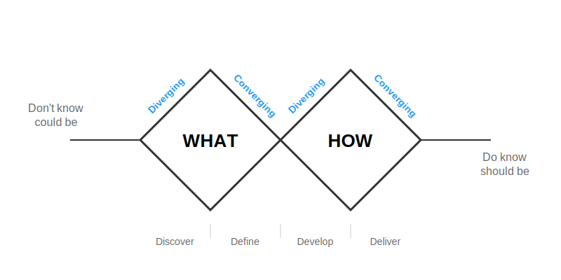

# Double Diamond Design Thinking Framework

The Double Diamond is a visual framework for design thinking that maps out the creative process through four distinct phases, represented by two diamond shapes placed side by side.

## The Four Phases

**First Diamond - Problem Definition**

1. **Discover** (Divergent): This opening phase involves broad exploration to understand the challenge. Designers conduct research, gather insights, observe users, and collect as much relevant information as possible without limiting their scope.

2. **Define** (Convergent): Here you narrow down findings from the discovery phase to clearly articulate the specific problem you're solving. This involves synthesizing research into actionable insights and defining the design brief or problem statement.

**Second Diamond - Solution Development**

3. **Develop** (Divergent): With a clear problem definition, this phase opens up again to explore multiple potential solutions. Teams brainstorm, prototype, and generate numerous ideas without judgment, encouraging creative thinking and experimentation.

4. **Deliver** (Convergent): The final phase focuses on refining, testing, and implementing the chosen solution. This involves iterating on prototypes, gathering feedback, and preparing the final design for launch.

## Key Principles

The framework emphasizes the importance of both **divergent thinking** (expanding possibilities) and **convergent thinking** (narrowing focus). The diamond shapes illustrate this expansion and contraction of ideas at each stage.

The process is iterative rather than linear - teams often cycle back through phases as they learn more about users and test solutions. The framework helps ensure thorough exploration of both the problem space and solution space before committing to a final direction.

This structured approach helps prevent teams from jumping to solutions too quickly while ensuring they eventually converge on actionable outcomes.

## Applied to Platform Engineering

Here we apply the double diamond to Platform Engineering. Specifically, to help Platform teams understand the experience of their "customers" (being the internal Engineers), identify the areas of opportunity that have the most value / make the most impact, and plan out the Platform-as-a-Product services that the Platform team should focus on. In effect creating a roadmap of work for Platform teams that is driven by the Engineering / Developer Experience and insights. 

**First Diamond - Problem Definition**

1. **Discover** (Divergent): Understand our "customers" by generating an Engineering Journey Map that describes their end-to-end experioence. Use this to help engage with Engineers and collect valuable input about the Developer Experience. 

2. **Define** (Convergent): Narrow down our findings from the discovery phase to clearly articulate the specific problem you're solving. We end up with a tailored Engineering Journey Map specific to our organization and with our priority opportunity areas identified and well described. 

**Second Diamond - Solution Development**

3. **Develop** (Divergent): With a clear problem definition, this phase opens up again to explore multiple potential solutions. We explore potential solutions for the prioritized opportunity areas, whilst also using the Jobs-to-be-Done framework to deeply understand our customers to design the best solutions. 

4. **Deliver** (Convergent): The final phase focuses on refining, testing, and implementing the chosen solution. We end up with clear solutions to implement, but also supported by a game plan to promote our solutions, drive adoption, and achieve successful outcomes. Utlimately, helping Platform teams take a Platform-as-a-Product minset and approach.